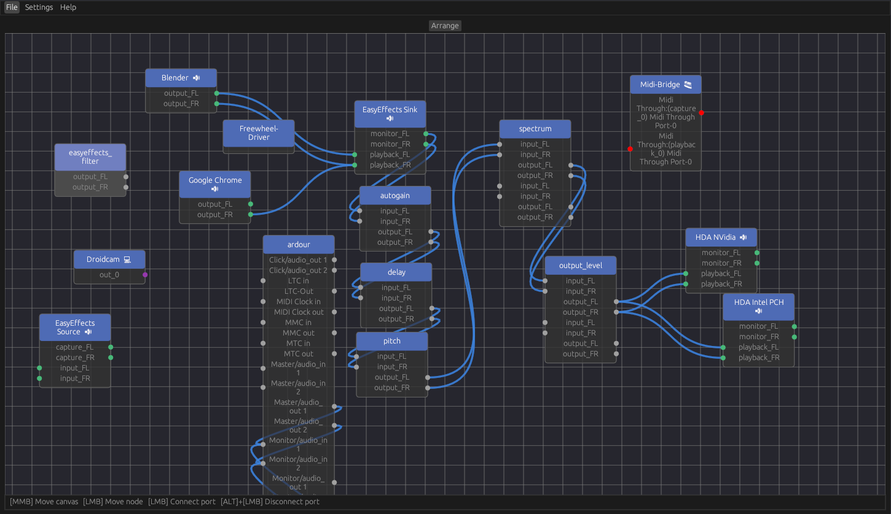

<div align="center">
    <h1>pw-viz</h1>
<h4> A simple and elegant, pipewire graph editor </h4>



</div>


This is still a WIP, node layouting is kinda jank at the moment.

# Installation
A compiled binary is available on the [releases page](https://github.com/Ax9D/pw-viz/releases).

## Building from source
To build pw-viz, you will need to have Rust installed. The recommended way to install Rust is from the [official download page](https://www.rust-lang.org/tools/install), using rustup.

### Stable Release
Download and extract the source code to the latest release over on the [releases page](https://github.com/Ax9D/pw-viz/releases).

### Main branch 
Alternatively, you can clone the main branch, although its NOT guaranteed to be stable or bug free.
```
git clone https://github.com/Ax9D/pw-viz
```

### Build
Next, `cd` into your source folder and then start the build using:
```
cargo build --release
```

Next you can copy the resulting binary(pw-viz) which will be found inside ```target/release``` to a directory in your ```$PATH```, like  ```/usr/bin/```

# Controls

 ||Description|
 |--- |---
 | Left Click + Drag | Move nodes, create links between ports |
 | <kbd>Alt</kbd>  + Left Click + Drag| Remove links |
 | Middle Mouse + Drag | Pan the graph |
 | <kbd>Ctrl</kbd> | Shows pipewire ids of nodes and ports |

Zooming is not supported currently


# Libraries Used
* [pipewire-rs](https://gitlab.freedesktop.org/pipewire/pipewire-rs): Rust bindings for PipeWire
* [egui-rs](https://github.com/emilk/egui): an easy-to-use immediate mode GUI in pure Rust
* A modified fork of [egui-nodes](https://github.com/haighcam/egui_nodes): A egui port of [imnodes](https://github.com/Nelarius/imnodes)

# Thanks / Alternatives
Pipewire connection code is inspired by helvum's implementation
* [helvum](https://gitlab.freedesktop.org/ryuukyu/helvum): A GTK patchbay for pipewire.

# License
pw-viz is licensed under the terms of the GNU General Public License v3.0. See LICENSE for more information.
